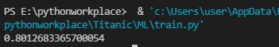
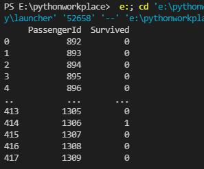

# ML_titanic

Use the RandomForest train of the TitanicSet

## 1 DataAnalysis 数据分析

* import.py  

    引入数据集，查看前五行，看看有什么特征值跟标签值。
    其次，调用info()，统计原始训练集里面的特征值与标签值
    的数量与类型。

    得出结果如下：
    age属性部分缺失，homedest属性部分缺失，
    room、ticke、boat属性严重缺失，并且有500多行数据是缺失
    大半数据的。

* AttributeDistribution.py

    数据可视化，由下图可知，总体获救情况，乘客乘坐不同等级舱的获救情况，不同年龄的获救情况，不同年龄在不同等级舱的分布情况以及各登船口岸上船人数

* ClassOfCabin.py

    单独把乘坐不同等级舱的获救情况拎出来分析分析，由下图可知，乘坐三等舱的人数最多，相对和绝对死亡比例也最大，乘坐一等舱的获救率最高，不管从总数还是比例上。所以等级舱可以当做影响获救率的因素之一。

* PassengerGender.py

    按性别分析获救情况，由下图可知，女性的获救率比男性高，可以当做影响获救率的因素之一。

* ClassOfCabin&PassengerGender.py

    将性别与乘坐不同等级舱两个因素结合起来分析，由下图可知，比起等级舱影响，性别这个因素影响得更大。

* Port.py

    单独分析各登录港乘客的获救情况，由下图可知，登录哪个港口对获救率影响不大。

* HomeToDest.py

    分析不同起始点目的点乘客的获救情况，由下图可知，不同起始点跟目的点的数量特别多，而且影响也不大。

## 2 DataProcessing 数据处理

* RemoveBlankValues.py

    这是一份对原始数据集进行第一层粗略处理的代码，由于在之前的数据分析得知，embarked(港口)，homedest(起始点目的点)缺失了部分的数据，我们为了简单处理，直接把这几行缺失的数据直接删除，其次room(居住房间)，ticket(船票),boat(救生船)不是缺失数据过多，就是对获救率几乎没有影响，所以我们直接把这几个属性删除，导出第一次处理后的数据集titanicOut2.csv

> [titanicOut2.csv](Titanic\DataSet\train\titanicOut2.csv)

* ProcessingIntoNumericalCharacteristics.py

    由于首次处理后的titanicOut2数据集的pclass(等级舱)，embarked(港口)，sex(性别)这三个属性的属性描述是用字符串的类型进行描述的。所以我们用整型的数据来替换掉这些字符串类型的描述。处理后导出titanicOut3.csv

> [titanicOut3.csv](Titanic\DataSet\train\titanicOut3.csv)

* DealWithTest.py

    这是一份对Test测试集进行简单处理的代码。首先，先删除关联不大的列。其次，将性别与登录港口两个属性转化为数值型特征。最后，把列名称改成跟训练集一致。导出第一次处理后的测试集testOut.csv

> [testOut.csv](Titanic\DataSet\test\testOut.csv)

* FittingMissingAgeData.py

    由于训练集与测试集的age都缺失了少部分数据，于是使用RandomForest这个算法，把年龄当做标签值，调用其他特征值来对这个年龄进行预测，把数据科学的填补一下。顺便再把embarked(登录港口)、sex(性别)、pclass(等级舱)这三个属性进行one-hot编码(ps：one-hot编码不懂的小伙伴可以去度娘或者谷歌娘一下，很简单的，类似于一变多的这样一个关系)。由此，导出了测试集testOut2.csv跟训练集titanicOut4.csv

> [testOut2.csv](Titanic\DataSet\test\testOut2.csv)
>
> [titanicOut4.csv](Titanic\DataSet\train\titanicOut4.csv)

* RemoveBlankValues2.py

    之前，对训练集进行处理的时候忘记把两个没什么用的属性也删除掉，所以凭着只加不改的原则，编写了这份代码把name(姓名)、homedest(起始点终点)这两列删除，导出最终处理完的训练集titanicOut5.csv

> [titanicOut5.csv](Titanic\DataSet\train\titanicOut5.csv)

## 3 ML 机器学习

* train.py

    在数据分析与数据处理后的机器学习部分反而显得比较简单。首先，使用Pandas库把训练集导入。接着，再把survived(获救)这一列抽出来当标签值训练集，剩下的当做特征值训练集。在这里我们使用的随机森林算法(RandomForest)来当模型。其次，这里我们使用了交叉验证的方法，用了管道连接的一个方式，这样可以先直接对模型进行打分，原理类似于把数据集既当训练集用也当测试集用，差不多就是前面的数据拿来训练的时候，后面的数据就拿来预测一下看看效果。这样跑下来的结果还是不错的，大概有80分出头。如下图所示：

* TestPredict.py

    这一份代码算是一个收尾，也是最终我们写了这么多代码后的一个应用。首先，训练集与模型的处理与之前一致。然后，再导入测试集，使用我们训练完的模型来进行预测。最后使用Pandas库处理一下显示下结果，并把结果导入为prediction.csv

> [prediction.csv](Titanic\DataSet\result\prediction.csv)

## 4 DataSet 数据集

* test 测试集

> [test.csv](Titanic\DataSet\test\test.csv)
>
> [testOut.csv](Titanic\DataSet\test\testOut.csv)
>
> [testOut2.csv](Titanic\DataSet\test\testOut2.csv)

* train 训练集

> [titanic.csv](Titanic\DataSet\train\titanic.csv)
>
> [titanicOut.csv](Titanic\DataSet\train\titanicOut.csv)
>
> [titanicOut2.csv](Titanic\DataSet\train\titanicOut2.csv)
>
> [titanicOut3.csv](Titanic\DataSet\train\titanicOut3.csv)
>
> [titanicOut4.csv](Titanic\DataSet\train\titanicOut4.csv)
>
> [titanicOut5.csv](Titanic\DataSet\train\titanicOut5.csv)

* result 预测结果

> [prediction.csv](Titanic\DataSet\result\prediction.csv)
