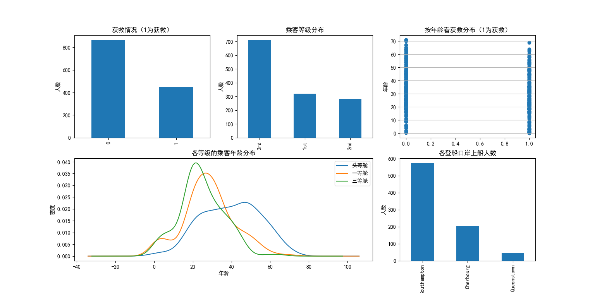

# ML_titanic

Use the RandomForest train of the TitanicSet

## 1 DataAnalysis 数据分析

* import.py  

    引入数据集，查看前五行，看看有什么特征值跟标签值。
    其次，调用info()，统计原始训练集里面的特征值与标签值
    的数量与类型。

    得出结果如下：
    age属性部分缺失，homedest属性部分缺失，
    room、ticke、boat属性严重缺失，并且有500多行数据是缺失
    大半数据的。

* AttributeDistribution.py

    数据可视化，由下图可知，总体获救情况，乘客乘坐不同等级舱的获救情况，不同年龄的获救情况，不同年龄在不同等级舱的分布情况以及各登船口岸上船人数

* ClassOfCabin.py

    单独把乘坐不同等级舱的获救情况拎出来分析分析，由下图可知，乘坐三等舱的人数最多，相对和绝对死亡比例也最大，乘坐一等舱的获救率最高，不管从总数还是比例上。所以等级舱可以当做影响获救率的因素之一。

* PassengerGender.py

    按性别分析获救情况，由下图可知，女性的获救率比男性高，可以当做影响获救率的因素之一。

* ClassOfCabin&PassengerGender.py

    将性别与乘坐不同等级舱两个因素结合起来分析，由下图可知，比起等级舱影响，性别这个因素影响得更大。

* Port.py

    单独分析各登录港乘客的获救情况，由下图可知，登录哪个港口对获救率影响不大。

* HomeToDest.py

    分析不同起始点目的点乘客的获救情况，由下图可知，不同起始点跟目的点的数量特别多，而且影响也不大。

## 2 DataProcessing 数据处理

* RemoveBlankValues.py

    这是一份对原始数据集进行第一层粗略处理的代码，由于在之前的数据分析得知，embarked(港口)，homedest(起始点目的点)缺失了部分的数据，我们为了简单处理，直接把这几行缺失的数据直接删除，其次room(居住房间)，ticket(船票),boat(救生船)不是缺失数据过多，就是对获救率几乎没有影响，所以我们直接把这几个属性删除，导出第一次处理后的数据集titanicOut2.csv

> [titanicOut2.csv](Titanic\DataSet\train\titanicOut2.csv)

* ProcessingIntoNumericalCharacteristics.py

    由于首次处理后的titanicOut2数据集的pclass(等级舱)，embarked(港口)，sex(性别)这三个属性的属性描述是用字符串的类型进行描述的。所以我们用整型的数据来替换掉这些字符串类型的描述。处理后导出titanicOut3.csv

> [titanicOut3.csv](Titanic\DataSet\train\titanicOut3.csv)

* DealWithT